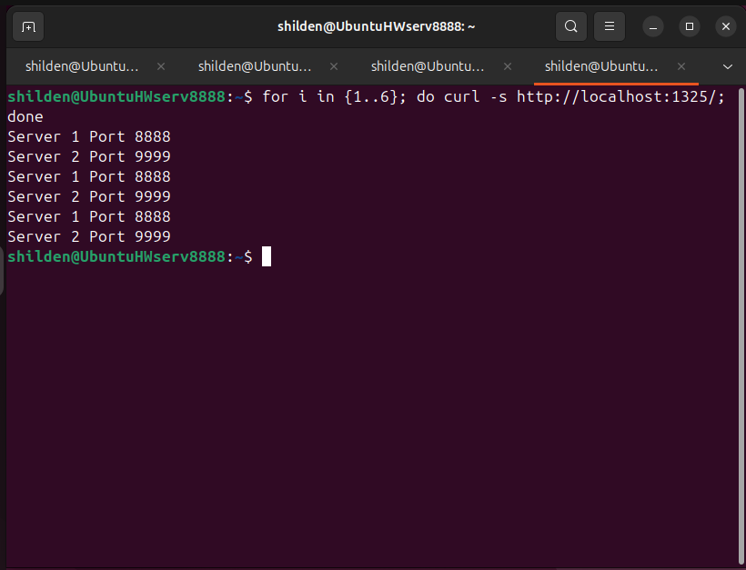

# Домашнее задание к занятию 2 «Кластеризация и балансировка нагрузки»

## Выполненные задачи

---
### Задание 1. Балансировка на 4 уровне (L4, TCP, Round Robin)

**Условие:**
- Запущено 2 Python сервера на портах 8888 и 9999
- Настроен HAProxy с балансировкой Round Robin на TCP уровне (порт 1325)

[**Конфигурационный файл**](configs/haproxy_task1.cfg)

```
global
        log /dev/log    local0
        log /dev/log    local1 notice
        chroot /var/lib/haproxy
        stats socket /run/haproxy/admin.sock mode 660 level admin expose-fd listeners
        stats timeout 30s
        user haproxy
        group haproxy
        daemon

defaults
        log     global
        mode    tcp
        option  tcplog
        option  dontlognull
        timeout connect 5000
        timeout client  50000
        timeout server  50000

# ============================================
# ЗАДАНИЕ 1: L4 Балансировка (TCP, Round Robin)
# ============================================
listen web_tcp
        bind :1325
        mode tcp
        balance roundrobin
        server s1 127.0.0.1:8888 check inter 3s
        server s2 127.0.0.1:9999 check inter 3s
```

**Результат проверки:**



```bash
$ for i in {1..6}; do curl -s http://localhost:1325/; done
Server 1 Port 8888
Server 2 Port 9999
Server 1 Port 8888
Server 2 Port 9999
Server 2 Port 9999
```

**Вывод:** Запросы чередуются между серверами (Round Robin) — балансировка работает корректно.

---

### Задание 2. Балансировка на 7 уровне (L7, HTTP, Weighted Round Robin)

Условие:

- Запущено 3 Python сервера с весами: порт 8888 (вес 2), порт 9999 (вес 3), порт 7777 (вес 4)

- HAProxy балансирует HTTP трафик только для домена example.local

- HAProxy слушает порт 8088

[**Конфигурационный файл**](configs/haproxy_task2.cfg)

```
global
        log /dev/log    local0
        log /dev/log    local1 notice
        chroot /var/lib/haproxy
        stats socket /run/haproxy/admin.sock mode 660 level admin expose-fd listeners
        stats timeout 30s
        user haproxy
        group haproxy
        daemon

defaults
        log     global
        mode    http
        option  httplog
        option  dontlognull
        timeout connect 5000
        timeout client  50000
        timeout server  50000

# ============================================
# ЗАДАНИЕ 2: L7 Балансировка (HTTP, Weighted Round Robin)
# ============================================
frontend example_http
        bind :8088
        mode http
        acl is_example_domain hdr(host) -i example.local
        use_backend servers_weighted if is_example_domain

backend servers_weighted
        mode http
        balance static-rr
        option httpchk
        server s1 127.0.0.1:8888 weight 2 check
        server s2 127.0.0.1:9999 weight 3 check
        server s3 127.0.0.1:7777 weight 4 check

# ============================================
# СТАТИСТИКА
# ============================================
listen stats
        bind :888
        mode http
        stats enable
        stats uri /stats
        stats refresh 5s
```

**Результаты проверки:**

1. Запрос без домена example.local


```
$ curl http://localhost:8088/
503 Service Unavailable
```
**Вывод:** Трафик не балансируется (ошибка 503) — изоляция по домену работает.

2. Запрос с доменом example.local


```
$ for i in {1..18}; do curl -s -H "Host: example.local" http://localhost:8088/; done
Server 1 Port 8888
Server 2 Port 9999
Server 3 Port 7777 - Weight 4
Server 2 Port 9999
Server 3 Port 7777 - Weight 4
Server 1 Port 8888
Server 3 Port 7777 - Weight 4
...
```

**Вывод:** Запросы распределяются согласно весам (сервер на порту 7777 с весом 4 встречается чаще других) — Weighted Round Robin работает.

---
