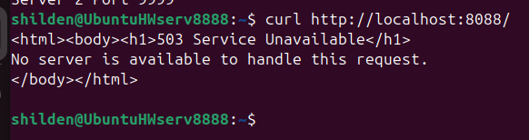
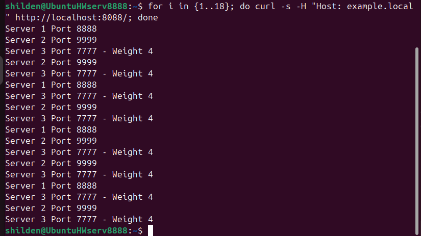

# Домашнее задание к занятию 2 «Кластеризация и балансировка нагрузки»

## Выполненные задачи

---
### Задание 1. Балансировка на 4 уровне (L4, TCP, Round Robin)

**Условие:**
- Запущено 2 Python сервера на портах 8888 и 9999
- Настроен HAProxy с балансировкой Round Robin на TCP уровне (порт 1325)

**Результат проверки:**


```bash
$ for i in {1..6}; do curl -s http://localhost:1325/; done
Server 1 Port 8888
Server 2 Port 9999
Server 1 Port 8888
Server 2 Port 9999
Server 2 Port 9999
```

**Вывод:** Запросы чередуются между серверами (Round Robin) — балансировка работает корректно.

---

### Задание 2. Балансировка на 7 уровне (L7, HTTP, Weighted Round Robin)

Условие:

Запущено 3 Python сервера с весами: порт 8888 (вес 2), порт 9999 (вес 3), порт 7777 (вес 4)

HAProxy балансирует HTTP трафик только для домена example.local

Результаты проверки:

1. Запрос без домена example.local



```
$ curl http://localhost:8088/
503 Service Unavailable
```
**Вывод:** Трафик не балансируется (ошибка 503) — изоляция по домену работает.

2. Запрос с доменом example.local


```
$ for i in {1..18}; do curl -s -H "Host: example.local" http://localhost:8088/; done
Server 1 Port 8888
Server 2 Port 9999
Server 3 Port 7777 - Weight 4
Server 2 Port 9999
Server 3 Port 7777 - Weight 4
Server 1 Port 8888
Server 3 Port 7777 - Weight 4
...
```
**Вывод:**Запросы распределяются согласно весам (сервер на порту 7777 с весом 4 встречается чаще других) — Weighted Round Robin работает.
---
